# Street Open API — Full Architecture
Generated from `Street Open API.json`

---
## Contents

- [Overview](#overview)
- [Authentication](#authentication)
- [Entity Diagram — All](#entity-all)
- [Entity Diagram — Property & Applicant](#entity-property-applicant)
- [Entity Diagram — Branch, Company & Area](#entity-branch-company-area)
- [Developer Notes](#developer-notes)
- [Endpoints](#endpoints)

<a name="overview"></a>
**Overview**
- Purpose: Architecture summary for the Street Open API, generated from Street Open API.json.
- Scope: Authentication, servers, representative API endpoints, data entities, per-endpoint sequence diagrams (Mermaid), and example request/response payloads.

**Servers**
- https://street.co.uk/open-api/v1 — Production.
- https://demo.street.co.uk/open-api/v1 — Testing.

<a name="authentication"></a>
**Authentication**
- Bearer token: use HTTP `Authorization: Bearer <token>`
- Top-level security: the spec requires `your-api-token` (see components.securitySchemes).
- Headers: `Accept: application/vnd.api+json`, `Content-Type: application/vnd.api+json`, `Authorization: Bearer <token>`
- Common errors: 401 Unauthorized, 403 Forbidden

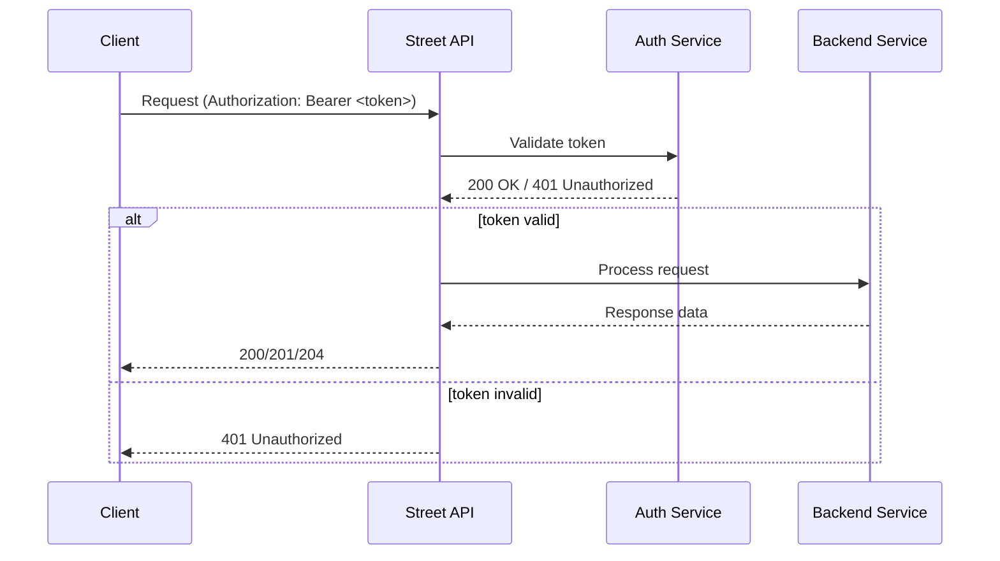

<a name="entity-all"></a>
## Entity Diagram — All


```mermaid
erDiagram
    APPLICANT {
      string id PK
      undefined at this time
      string branch_id FK
    }
    AREA {
      string id PK
      undefined at this time
    }
    BRANCH {
      string id PK
      undefined at this time
    }
    COMPANY {
      string id PK
      undefined at this time
    }
    PROPERTY {
      string id PK
      undefined at this time
      string branch_id FK
      string owner_id FK
    }
    INCLUDEDRESOURCE {
      string id PK
      undefined at this time
    }
    BASEMODEL {
      string id PK
      undefined at this time
    }
    UPLOADEDMEDIA {
      string id PK
      string name
      integer order
      boolean is_featured
      boolean include_in_listing
      integer feature_index
      string title
      string media_type
      string url
      string deleted_at
      string created_at
      string updated_at
    }
    MEDIA {
      string id PK
      undefined at this time
    }
    APPLICANT }o--|| INCLUDEDBRANCH : belongs_to
    APPLICANT ||--o{ INCLUDEDVIEWING : has_many
    APPLICANT ||--o{ INCLUDEDSALESOFFER : has_many
    APPLICANT ||--o{ INCLUDEDPERSON : has_many
    APPLICANT ||--o{ INCLUDEDNOTES : has_many
    APPLICANT ||--o{ INCLUDEDSALE : has_many
    APPLICANT ||--o{ INCLUDEDFOLLOWUP : has_many
    BRANCH ||--o{ INCLUDEDUSER : has_many
    BRANCH ||--o{ INCLUDEDPROPERTY : has_many
    BRANCH ||--o{ INCLUDEDAPPLICANT : has_many
    COMPANY ||--o{ INCLUDEDPROPERTY : has_many
    COMPANY ||--o{ INCLUDEDAPPLICANT : has_many
    COMPANY ||--o{ INCLUDEDPERSON : has_many
    PROPERTY }o--|| INCLUDEDBRANCH : belongs_to
    PROPERTY }o--|| INCLUDEDOWNER : belongs_to
    PROPERTY ||--o{ MEDIA : has_many
    PROPERTY ||--o{ INCLUDEDFLOORPLAN : has_many
    PROPERTY ||--o{ INCLUDEDROOM : has_many
    PROPERTY ||--o{ INCLUDEDOUTSIDESPACE : has_many
    PROPERTY ||--o{ PARKING : has_many
    PROPERTY ||--o{ INCLUDEDVIEWING : has_many
    PROPERTY ||--o{ INCLUDEDVALUATION : has_many
    PROPERTY ||--o{ INCLUDEDNOTES : has_many
    PROPERTY ||--o{ INCLUDEDSALE : has_many
    PROPERTY ||--o{ INCLUDEDINTERESTEDAPPLICANT : has_many
    PROPERTY ||--o{ INCLUDEDPROPERTYKEY : has_many
```

---
<a name="developer-notes"></a>
## Developer Notes

This section contains practical guidance for developers and business analysts integrating with the Street Open API.

- **API Style**: The API follows JSON:API conventions — top-level `data`, `attributes`, `relationships`, and `meta` for pagination.
- **Authentication**: Use an HTTP Bearer token in the `Authorization` header. Example: `Authorization: Bearer <token>`
- **Headers**: Always set `Accept: application/vnd.api+json` and `Content-Type: application/vnd.api+json` for write requests.

### Common Patterns

- **List endpoints** return `data` as an array and include `meta.pagination` for paging details.
- **Get single resource** returns `data` as an object with `type`, `id`, `attributes`, and optional `relationships`.
- **Create / Update**: send `data.type` and `data.attributes`; relationships may be supplied as `data.relationships` with `data: { type, id }`.

### Pagination & Filtering

- Use query parameters where supported: `?page[number]=1&page[size]=25` for pagination.
- Filtering and sorting are supported on some collection endpoints — prefer `filter[...]` and `sort` query parameters when available.

### Error Handling

- Errors use standard HTTP status codes. Body may include JSON:API error objects with `title`, `detail`, and `status`.
- 401 indicates an invalid token; 403 indicates insufficient permissions; 404 resource not found; 422 validation error.

### Example cURL — create an activity

```bash
curl -X POST "https://demo.street.co.uk/open-api/v1/activity"
  -H "Accept: application/vnd.api+json"
  -H "Content-Type: application/vnd.api+json"
  -H "Authorization: Bearer YOUR_TOKEN"
  -d
  "{"data":{"type":"activity","attributes":{"activity_type":"campaign_sent","title":"Example"}}}"
```

### Integration Tips

- Cache GET results where possible and respect `ETag`/`Last-Modified` if provided.
- Use idempotency keys for retrying create operations if the API supports them (check per-endpoint docs).
- When syncing large datasets, prefer incremental sync endpoints or use `updated_at` filters if available.

### Typical Business Flows (examples)

- **Onboard a Property**: create property resource → upload media → attach media via relationships → create listing.
- **Applicant flow**: create applicant → create viewing → link applicant to viewing → capture offers.

---
<a name="entity-property-applicant"></a>
## Entity Diagram — Property & Applicant

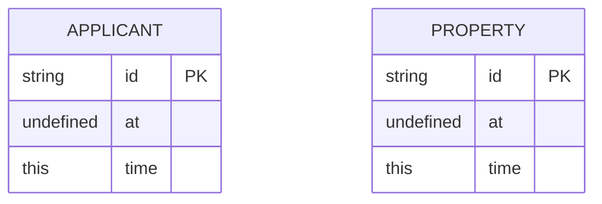

---
<a name="entity-branch-company-area"></a>
## Entity Diagram — Branch, Company & Area

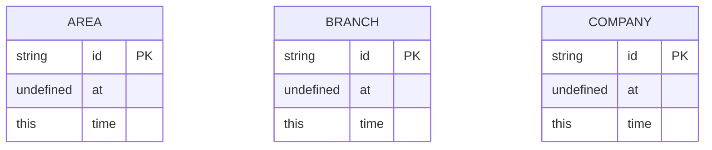

<a name="endpoints"></a>
## /activity

### POST /activity
- **Summary**: Create a activity log
- **OperationId**: post-activity
- **Tags**: Activity


Example request (abridged):
```json
{
  "data": {
    "type": "activity",
    "attributes": {
      "activity_type": "campaign_sent",
      "title": "string",
      "source": "property_reports"
    },
    "relationships": null
  }
}
```
Example response (201) (abridged):
_No content_

---

## /network-settings
## /lettings-applicants

### GET /lettings-applicants
- **Summary**: Get all Lettings Applicants
- **OperationId**: get-lettings-applicants
- **Tags**: Applicants

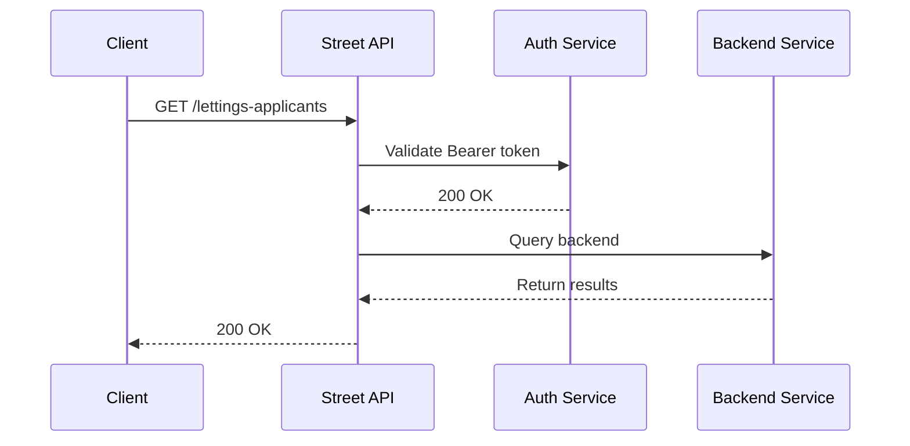

Example response (200) (abridged):
```json
{
  "data": [
    {
      "type": "applicant",
      "id": "sample-id",
      "attributes": null
    }
  ],
  "meta": {
    "pagination": {
      "total": 1,
      "count": 1,
      "per_page": 10,
      "current_page": 1,
      "total_pages": 1
    }
  }
}
```

**Expanded examples**

```bash
curl -X GET "https://demo.street.co.uk/open-api/v1/lettings-applicants"
  -H "Accept: application/vnd.api+json"
  -H "Content-Type: application/vnd.api+json"
  -H "Authorization: Bearer YOUR_TOKEN"
```

Example error response (422)
```json
{
  "errors": [
    {
      "status": "422",
      "title": "Validation Failed",
      "detail": "One or more attributes failed validation."
    }
  ]
}
```

**Pagination / filter examples**

```bash
curl "https://demo.street.co.uk/open-api/v1/lettings-applicants?page[number]=1&page[size]=25" -H "Accept: application/vnd.api+json" -H "Authorization: Bearer YOUR_TOKEN"

curl "https://demo.street.co.uk/open-api/v1/lettings-applicants?filter[name]=sample&sort=-created_at&page[number]=1&page[size]=25" -H "Accept: application/vnd.api+json" -H "Authorization: Bearer YOUR_TOKEN"
```

---

## /lettings-applicants/{applicant_id}
*Path-level parameters:*
- `applicant_id (path)` — The UUID of the Applicant.

### GET /lettings-applicants/{applicant_id}
- **Summary**: Get a single Lettings Applicant
- **OperationId**: get-lettings-applicants-applicantId
- **Tags**: Applicants

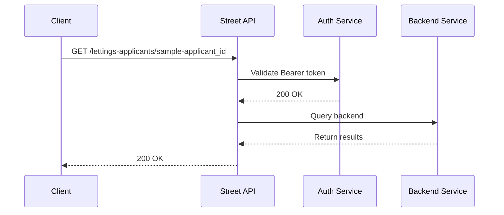

Example response (200) (abridged):
```json
{
  "data": {
    "type": "applicant",
    "id": "sample-id",
    "attributes": null
  }
}
```

**Expanded examples**

```bash
curl -X GET "https://demo.street.co.uk/open-api/v1/lettings-applicants/sample-applicant_id"
  -H "Accept: application/vnd.api+json"
  -H "Content-Type: application/vnd.api+json"
  -H "Authorization: Bearer YOUR_TOKEN"
```

Example error response (422)
```json
{
  "errors": [
    {
      "status": "422",
      "title": "Validation Failed",
      "detail": "One or more attributes failed validation."
    }
  ]
}
```

---

## /sales-applicants

### GET /sales-applicants
- **Summary**: Get all Sales Applicants
- **OperationId**: get-sales-applicants
- **Tags**: Applicants

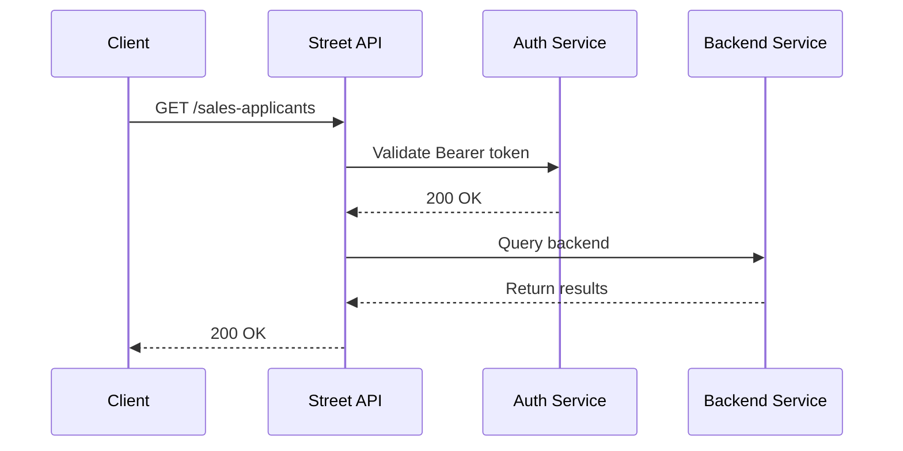

Example response (200) (abridged):
```json
{
  "data": [
    {
      "type": "applicant",
      "id": "sample-id",
      "attributes": null
    }
  ],
  "meta": {
    "pagination": {
      "total": 1,
      "count": 1,
      "per_page": 10,
      "current_page": 1,
      "total_pages": 1
    }
  }
}
```

**Expanded examples**

```bash
curl -X GET "https://demo.street.co.uk/open-api/v1/sales-applicants"
  -H "Accept: application/vnd.api+json"
  -H "Content-Type: application/vnd.api+json"
  -H "Authorization: Bearer YOUR_TOKEN"
```

Example error response (422)
```json
{
  "errors": [
    {
      "status": "422",
      "title": "Validation Failed",
      "detail": "One or more attributes failed validation."
    }
  ]
}
```

**Pagination / filter examples**

```bash
curl "https://demo.street.co.uk/open-api/v1/sales-applicants?page[number]=1&page[size]=25" -H "Accept: application/vnd.api+json" -H "Authorization: Bearer YOUR_TOKEN"

curl "https://demo.street.co.uk/open-api/v1/sales-applicants?filter[name]=sample&sort=-created_at&page[number]=1&page[size]=25" -H "Accept: application/vnd.api+json" -H "Authorization: Bearer YOUR_TOKEN"
```

---

## /sales-applicants/{applicant_id}
*Path-level parameters:*
- `applicant_id (path)` — The UUID of the Applicant.

### GET /sales-applicants/{applicant_id}
- **Summary**: Get a single Sales Applicant
- **OperationId**: get-sales-applicants-applicantId
- **Tags**: Applicants

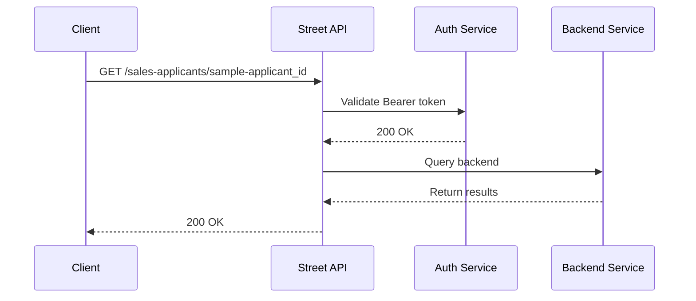

Example response (200) (abridged):
```json
{
  "data": {
    "type": "applicant",
    "id": "sample-id",
    "attributes": null
  }
}
```

**Expanded examples**

```bash
curl -X GET "https://demo.street.co.uk/open-api/v1/sales-applicants/sample-applicant_id"
  -H "Accept: application/vnd.api+json"
  -H "Content-Type: application/vnd.api+json"
  -H "Authorization: Bearer YOUR_TOKEN"
```

Example error response (422)
```json
{
  "errors": [
    {
      "status": "422",
      "title": "Validation Failed",
      "detail": "One or more attributes failed validation."
    }
  ]
}
```

---

## /areas

### GET /areas
- **Summary**: Get all Areas
- **OperationId**: get-areas
- **Tags**: Areas

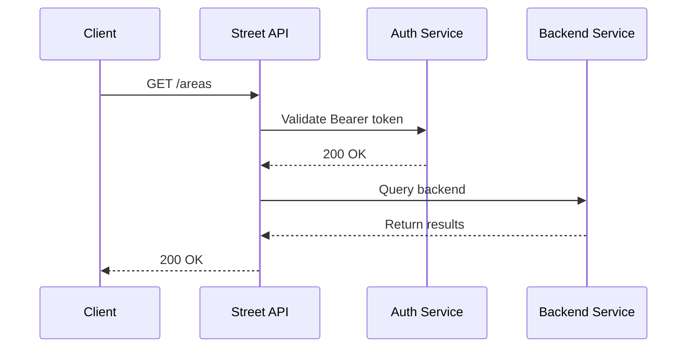

Example response (200) (abridged):
```json
{
  "data": [
    {
      "type": "area",
      "id": "sample-id",
      "attributes": null
    }
  ],
  "meta": {
    "pagination": {
      "total": 1,
      "count": 1,
      "per_page": 10,
      "current_page": 1,
      "total_pages": 1
    }
  }
}
```

---

## /branches

### GET /branches
- **Summary**: Get all Branches
- **OperationId**: get-branches
- **Tags**: Branches


Example response (200) (abridged):
```json
{
  "data": [
    {
      "type": "branch",
      "id": "sample-id",
      "attributes": null
    }
  ],
  "meta": {
    "pagination": {
      "total": 1,
      "count": 1,
      "per_page": 10,
      "current_page": 1,
      "total_pages": 1
    }
  }
}
```

---

## /branches/{branch_id}

### GET /branches/{branch_id}
- **Summary**: Get a single Branch
- **OperationId**: get-branch
- **Tags**: Branches

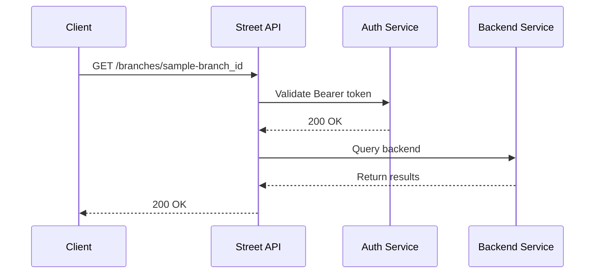

Example response (200) (abridged):
```json
{
  "data": {
    "type": "branch",
    "id": "sample-id",
    "attributes": null
  }
}
```

---

## /brands

### GET /brands
- **Summary**: Get all Brands
- **OperationId**: get-brands
- **Tags**: Brands


Example response (200) (abridged):
```json
{
  "data": [
    {
      "type": "brand",
      "id": "sample-id",
      "attributes": null
    }
  ],
  "meta": {
    "pagination": {
      "total": 1,
      "count": 1,
      "per_page": 10,
      "current_page": 1,
      "total_pages": 1
    }
  }
}
```

---

## /brands/{brand_id}

### GET /brands/{brand_id}
- **Summary**: Get a single Brand
- **OperationId**: get-brand
- **Tags**: Brands

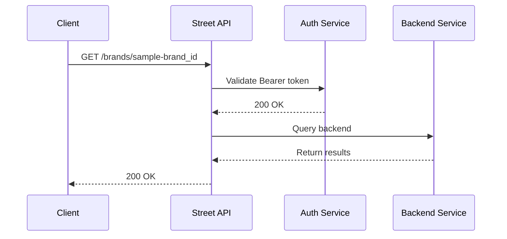

Example response (200) (abridged):
```json
{
  "data": {
    "type": "brand",
    "id": "sample-id",
    "attributes": null
  }
}
```

---

## /lettings-applications/{application_id}
*Path-level parameters:*
- `application_id (path)` — The UUID of the Application.

### GET /lettings-applications/{application_id}
- **Summary**: Get a single Lettings Application
- **OperationId**: get-lettings-applications-application_id
- **Tags**: Lettings Applications

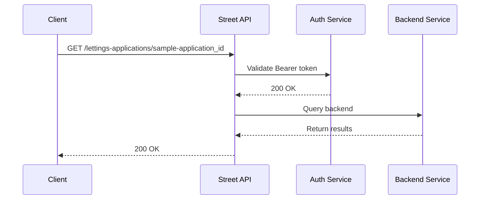

Example response (200) (abridged):
```json
{
  "data": {
    "type": "lettingsapplication",
    "id": "sample-id",
    "attributes": null
  }
}
```

---

## /companies

### GET /companies
- **Summary**: Get all Companies
- **OperationId**: get-companies
- **Tags**: Companies


Example response (200) (abridged):
```json
{
  "data": [
    {
      "type": "company",
      "id": "sample-id",
      "attributes": null
    }
  ],
  "meta": {
    "pagination": {
      "total": 1,
      "count": 1,
      "per_page": 10,
      "current_page": 1,
      "total_pages": 1
    }
  }
}
```

---

## /companies/{company_id}
*Path-level parameters:*
- `company_id (path)` — The UUID of the Company.

### GET /companies/{company_id}
- **Summary**: Get a single Company
- **OperationId**: get-companies-companyId
- **Tags**: Companies

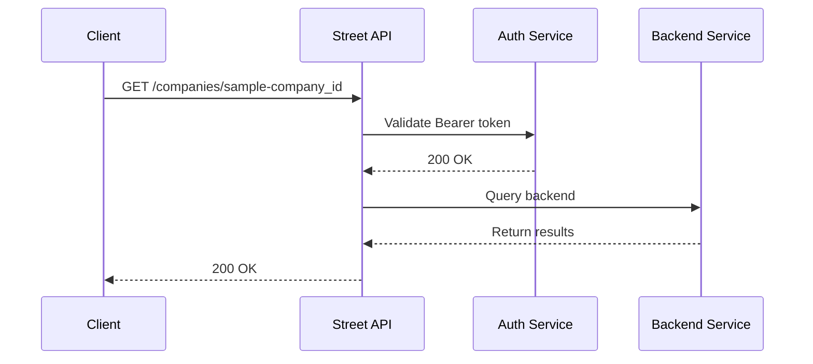

Example response (200) (abridged):
```json
{
  "data": {
    "type": "company",
    "id": "sample-id",
    "attributes": null
  }
}
```

---

## /documents

### POST /documents
- **Summary**: Create a Document
- **OperationId**: post-documents
- **Tags**: Documents

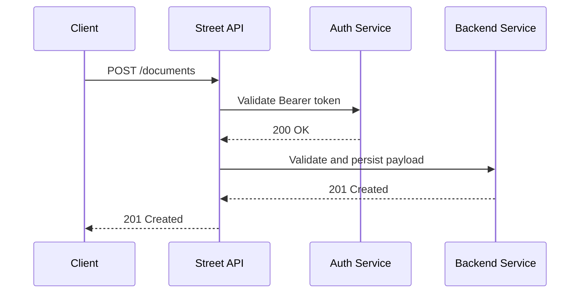

Example request (abridged):
```json
{
  "data": {
    "type": "document",
    "attributes": {
      "file_url": "string",
      "title": "string"
    },
    "relationships": null
  }
}
```
Example response (201) (abridged):
```json
{
  "data": {
    "type": "media",
    "id": "sample-id",
    "attributes": null
  }
}
```

---

## /photos/{property_id}/media/{media_id}

### PATCH /photos/{property_id}/media/{media_id}
- **Summary**: Update a photos details
- **OperationId**: patch-photos-propertyId-imageId
- **Tags**: Images

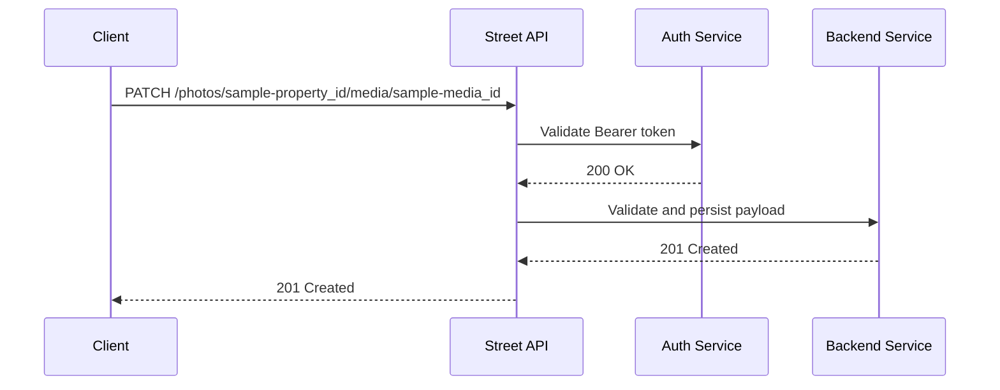

Example request (abridged):
```json
{
  "data": {
    "type": "image",
    "attributes": {
      "title": "string",
      "include_in_listing": true
    }
  }
}
```
Example response (200) (abridged):
```json
{
  "data": {
    "type": "uploadedmedia",
    "id": "sample-id",
    "attributes": {
      "name": "string",
      "order": 123,
      "is_featured": null,
      "include_in_listing": null,
      "feature_index": 123
    }
  }
}
```

---


### DELETE /photos/{property_id}/media/{media_id}
- **Summary**: Delete a photo from a property
- **OperationId**: delete-photos-propertyId-imageId
- **Tags**: Images

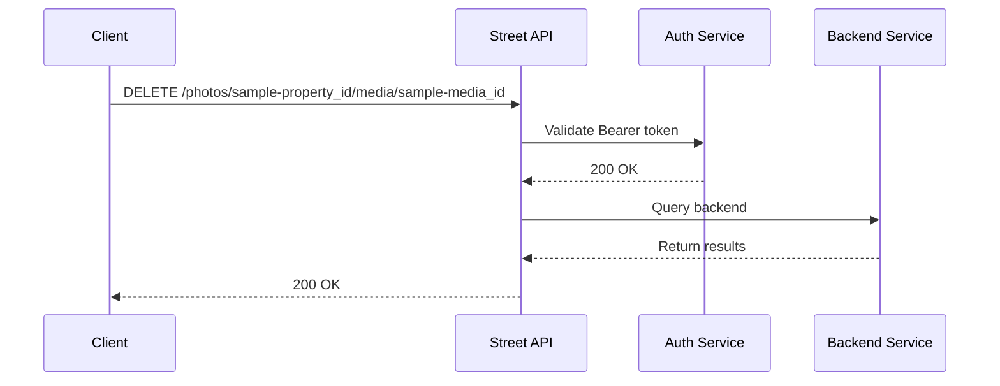

Example response (204) (abridged):
_No content_

---

## /floorplans/{property_id}/media/{media_id}

### DELETE /floorplans/{property_id}/media/{media_id}
- **Summary**: Delete a floorplan from a property
- **OperationId**: delete-floorplans-propertyId-imageId
- **Tags**: Images

```mermaid
sequenceDiagram
    participant Client
    participant API as Street API
    participant Auth as Auth Service
    participant Store as Backend Service
    Client->>API: DELETE /floorplans/sample-property_id/media/sample-media_id
    API->>Auth: Validate Bearer token
    Auth-->>API: 200 OK
    API->>Store: Query backend
    Store-->>API: Return results
    API-->>Client: 200 OK
```

Example response (204) (abridged):
_No content_

---

## /enquiries

### GET /enquiries
- **Summary**: Get all Enquiries
- **OperationId**: get-enquiries
- **Tags**: Enquiries

```mermaid
sequenceDiagram
    participant Client
    participant API as Street API
    participant Auth as Auth Service
    participant Store as Backend Service
    Client->>API: GET /enquiries
    API->>Auth: Validate Bearer token
    Auth-->>API: 200 OK
    API->>Store: Query backend
    Store-->>API: Return results
    API-->>Client: 200 OK
```

Example response (200) (abridged):
```json
{
  "data": [
    {
      "type": "enquiry",
      "id": "sample-id",
      "attributes": null
    }
  ],
  "meta": {
    "pagination": {
      "total": 1,
      "count": 1,
      "per_page": 10,
      "current_page": 1,
      "total_pages": 1
    }
  }
}
```

---


### POST /enquiries
- **Summary**: Create an Enquiry
- **OperationId**: post-enquiries
- **Tags**: Enquiries

```mermaid
sequenceDiagram
    participant Client
    participant API as Street API
    participant Auth as Auth Service
    participant Store as Backend Service
    Client->>API: POST /enquiries
    API->>Auth: Validate Bearer token
    Auth-->>API: 200 OK
    API->>Store: Validate and persist payload
    Store-->>API: 201 Created
    API-->>Client: 201 Created
```

Example request (abridged):
```json
{
  "data": {
    "type": "enquiry",
    "attributes": {
      "email_address": "string",
      "message": "string"
    },
    "relationships": null
  }
}
```
Example response (201) (abridged):
```json
{
  "data": {
    "type": "enquiry",
    "id": "sample-id",
    "attributes": null
  }
}
```

---

## /enquiries/{enquiry_id}
*Path-level parameters:*
- `enquiry_id (path)` — The UUID of the Enquiry.

### GET /enquiries/{enquiry_id}
- **Summary**: Get a single Enquiry
- **OperationId**: get-enquiries-enquiryId
- **Tags**: Enquiries

```mermaid
sequenceDiagram
    participant Client
    participant API as Street API
    participant Auth as Auth Service
    participant Store as Backend Service
    Client->>API: GET /enquiries/sample-enquiry_id
    API->>Auth: Validate Bearer token
    Auth-->>API: 200 OK
    API->>Store: Query backend
    Store-->>API: Return results
    API-->>Client: 200 OK
```

Example response (200) (abridged):
```json
{
  "data": {
    "type": "enquiry",
    "id": "sample-id",
    "attributes": null
  }
}
```

---

## /follow-ups

### GET /follow-ups
- **Summary**: Get all Follow Ups
- **OperationId**: get-follow-ups
- **Tags**: Follow Ups

```mermaid
sequenceDiagram
    participant Client
    participant API as Street API
    participant Auth as Auth Service
    participant Store as Backend Service
    Client->>API: GET /follow-ups
    API->>Auth: Validate Bearer token
    Auth-->>API: 200 OK
    API->>Store: Query backend
    Store-->>API: Return results
    API-->>Client: 200 OK
```

Example response (200) (abridged):
```json
{
  "data": [
    {
      "type": "followup",
      "id": "sample-id",
      "attributes": null
    }
  ],
  "meta": {
    "pagination": {
      "total": 1,
      "count": 1,
      "per_page": 10,
      "current_page": 1,
      "total_pages": 1
    }
  }
}
```

---


### POST /follow-ups
- **Summary**: Create a Follow Up
- **OperationId**: post-follow-ups
- **Tags**: Follow Ups

```mermaid
sequenceDiagram
    participant Client
    participant API as Street API
    participant Auth as Auth Service
    participant Store as Backend Service
    Client->>API: POST /follow-ups
    API->>Auth: Validate Bearer token
    Auth-->>API: 200 OK
    API->>Store: Validate and persist payload
    Store-->>API: 201 Created
    API-->>Client: 201 Created
```

Example request (abridged):
```json
{
  "data": {
    "type": "follow-up",
    "attributes": {
      "due_date": "2024-01-01"
    },
    "relationships": null
  }
}
```
Example response (201) (abridged):
```json
{
  "data": {
    "type": "followup",
    "id": "sample-id",
    "attributes": null
  }
}
```

---

## /todos

### GET /todos
- **Summary**: Get all Tasks
- **OperationId**: get-todos
- **Tags**: Tasks

```mermaid
sequenceDiagram
    participant Client
    participant API as Street API
    participant Auth as Auth Service
    participant Store as Backend Service
    Client->>API: GET /todos
    API->>Auth: Validate Bearer token
    Auth-->>API: 200 OK
    API->>Store: Query backend
    Store-->>API: Return results
    API-->>Client: 200 OK
```

Example response (200) (abridged):
```json
{
  "data": [
    {
      "type": "todo",
      "id": "sample-id",
      "attributes": null
    }
  ],
  "meta": {
    "pagination": {
      "total": 1,
      "count": 1,
      "per_page": 10,
      "current_page": 1,
      "total_pages": 1
    }
  }
}
```

---


### POST /todos
- **Summary**: Create a Task
- **OperationId**: post-todos
- **Tags**: Tasks

```mermaid
sequenceDiagram
    participant Client
    participant API as Street API
    participant Auth as Auth Service
    participant Store as Backend Service
    Client->>API: POST /todos
    API->>Auth: Validate Bearer token
    Auth-->>API: 200 OK
    API->>Store: Validate and persist payload
    Store-->>API: 201 Created
    API-->>Client: 201 Created
```

Example request (abridged):
```json
{
  "data": {
    "type": "todo",
    "attributes": {
      "title": "string"
    },
    "relationships": null
  }
}
```
Example response (201) (abridged):
```json
{
  "data": {
    "type": "todo",
    "id": "sample-id",
    "attributes": null
  }
}
```

---

## /todo-types

### GET /todo-types
- **Summary**: Get all Task Types
- **OperationId**: get-todo-types
- **Tags**: Tasks

```mermaid
sequenceDiagram
    participant Client
    participant API as Street API
    participant Auth as Auth Service
    participant Store as Backend Service
    Client->>API: GET /todo-types
    API->>Auth: Validate Bearer token
    Auth-->>API: 200 OK
    API->>Store: Query backend
    Store-->>API: Return results
    API-->>Client: 200 OK
```

Example response (200) (abridged):
```json
{
  "data": [
    {
      "type": "todotype",
      "id": "sample-id",
      "attributes": null
    }
  ],
  "meta": {
    "pagination": {
      "total": 1,
      "count": 1,
      "per_page": 10,
      "current_page": 1,
      "total_pages": 1
    }
  }
}
```

---

## /todo-types/{todo_type_id}
*Path-level parameters:*
- `todo_type_id (path)` — The UUID of the Task Type.

### GET /todo-types/{todo_type_id}
- **Summary**: Get a single Task Type
- **OperationId**: get-todo-types-todoTypeID
- **Tags**: Tasks

```mermaid
sequenceDiagram
    participant Client
    participant API as Street API
    participant Auth as Auth Service
    participant Store as Backend Service
    Client->>API: GET /todo-types/sample-todo_type_id
    API->>Auth: Validate Bearer token
    Auth-->>API: 200 OK
    API->>Store: Query backend
    Store-->>API: Return results
    API-->>Client: 200 OK
```

Example response (200) (abridged):
```json
{
  "data": {
    "type": "todotype",
    "id": "sample-id",
    "attributes": null
  }
}
```

---

## /solicitors

### GET /solicitors
- **Summary**: Get all Solicitors
- **OperationId**: get-solicitors
- **Tags**: Solicitors

```mermaid
sequenceDiagram
    participant Client
    participant API as Street API
    participant Auth as Auth Service
    participant Store as Backend Service
    Client->>API: GET /solicitors
    API->>Auth: Validate Bearer token
    Auth-->>API: 200 OK
    API->>Store: Query backend
    Store-->>API: Return results
    API-->>Client: 200 OK
```

Example response (200) (abridged):
```json
{
  "data": [
    {
      "type": "solicitor",
      "id": "sample-id",
      "attributes": null
    }
  ],
  "meta": {
    "pagination": {
      "total": 1,
      "count": 1,
      "per_page": 10,
      "current_page": 1,
      "total_pages": 1
    }
  }
}
```

---

## /solicitors/{solicitor_id}
*Path-level parameters:*
- `solicitor_id (path)` — The UUID of the Solicitor.

### GET /solicitors/{solicitor_id}
- **Summary**: Get a single Solicitor
- **OperationId**: get-solicitors-solicitorID
- **Tags**: Solicitors

```mermaid
sequenceDiagram
    participant Client
    participant API as Street API
    participant Auth as Auth Service
    participant Store as Backend Service
    Client->>API: GET /solicitors/sample-solicitor_id
    API->>Auth: Validate Bearer token
    Auth-->>API: 200 OK
    API->>Store: Query backend
    Store-->>API: Return results
    API-->>Client: 200 OK
```

Example response (200) (abridged):
```json
{
  "data": {
    "type": "solicitor",
    "id": "sample-id",
    "attributes": null
  }
}
```

---

## /landlords

### GET /landlords
- **Summary**: Get all Landlords
- **OperationId**: get-landlords
- **Tags**: Landlords

```mermaid
sequenceDiagram
    participant Client
    participant API as Street API
    participant Auth as Auth Service
    participant Store as Backend Service
    Client->>API: GET /landlords
    API->>Auth: Validate Bearer token
    Auth-->>API: 200 OK
    API->>Store: Query backend
    Store-->>API: Return results
    API-->>Client: 200 OK
```

Example response (200) (abridged):
```json
{
  "data": [
    {
      "type": "landlord",
      "id": "sample-id",
      "attributes": null
    }
  ],
  "meta": {
    "pagination": {
      "total": 1,
      "count": 1,
      "per_page": 10,
      "current_page": 1,
      "total_pages": 1
    }
  }
}
```

---

## /landlords/{landlord_id}
*Path-level parameters:*
- `landlord_id (path)` — The UUID of the Landlord.

### GET /landlords/{landlord_id}
- **Summary**: Get a single Landlord
- **OperationId**: get-landlords-landlordId
- **Tags**: Landlords

```mermaid
sequenceDiagram
    participant Client
    participant API as Street API
    participant Auth as Auth Service
    participant Store as Backend Service
    Client->>API: GET /landlords/sample-landlord_id
    API->>Auth: Validate Bearer token
    Auth-->>API: 200 OK
    API->>Store: Query backend
    Store-->>API: Return results
    API-->>Client: 200 OK
```

Example response (200) (abridged):
```json
{
  "data": {
    "type": "landlord",
    "id": "sample-id",
    "attributes": null
  }
}
```

---

## /lettings-offers

### GET /lettings-offers
- **Summary**: Get all Lettings Offers
- **OperationId**: get-lettings-offers
- **Tags**: Lettings Offers

```mermaid
sequenceDiagram
    participant Client
    participant API as Street API
    participant Auth as Auth Service
    participant Store as Backend Service
    Client->>API: GET /lettings-offers
    API->>Auth: Validate Bearer token
    Auth-->>API: 200 OK
    API->>Store: Query backend
    Store-->>API: Return results
    API-->>Client: 200 OK
```

Example response (200) (abridged):
```json
{
  "data": [
    {
      "type": "lettingsoffer",
      "id": "sample-id",
      "attributes": null
    }
  ],
  "meta": {
    "pagination": {
      "total": 1,
      "count": 1,
      "per_page": 10,
      "current_page": 1,
      "total_pages": 1
    }
  }
}
```

---

## /lettings-offers/{lettings_offer_id}
*Path-level parameters:*
- `lettings_offer_id (path)` — The UUID of the Lettings Offer.

### GET /lettings-offers/{lettings_offer_id}
- **Summary**: Get a single Lettings Offer
- **OperationId**: get-lettings-offers-lettingsOfferId
- **Tags**: Lettings Offers

```mermaid
sequenceDiagram
    participant Client
    participant API as Street API
    participant Auth as Auth Service
    participant Store as Backend Service
    Client->>API: GET /lettings-offers/sample-lettings_offer_id
    API->>Auth: Validate Bearer token
    Auth-->>API: 200 OK
    API->>Store: Query backend
    Store-->>API: Return results
    API-->>Client: 200 OK
```

Example response (200) (abridged):
```json
{
  "data": {
    "type": "lettingsoffer",
    "id": "sample-id",
    "attributes": null
  }
}
```

---

## /maintenance-jobs

### GET /maintenance-jobs
- **Summary**: Get all Maintence Jobs
- **OperationId**: get-maintenance-jobs
- **Tags**: Maintenance Jobs

```mermaid
sequenceDiagram
    participant Client
    participant API as Street API
    participant Auth as Auth Service
    participant Store as Backend Service
    Client->>API: GET /maintenance-jobs
    API->>Auth: Validate Bearer token
    Auth-->>API: 200 OK
    API->>Store: Query backend
    Store-->>API: Return results
    API-->>Client: 200 OK
```

Example response (200) (abridged):
```json
{
  "data": [
    {
      "type": "maintenancejob",
      "id": "sample-id",
      "attributes": null
    }
  ],
  "meta": {
    "pagination": {
      "total": 1,
      "count": 1,
      "per_page": 10,
      "current_page": 1,
      "total_pages": 1
    }
  }
}
```

---

## /maintenance-jobs/{maintenance_job_id}
*Path-level parameters:*
- `maintenance_job_id (path)` — 

### GET /maintenance-jobs/{maintenance_job_id}
- **Summary**: Get a single Maintence Job
- **OperationId**: get-maintenance-job
- **Tags**: Maintenance Jobs

```mermaid
sequenceDiagram
    participant Client
    participant API as Street API
    participant Auth as Auth Service
    participant Store as Backend Service
    Client->>API: GET /maintenance-jobs/sample-maintenance_job_id
    API->>Auth: Validate Bearer token
    Auth-->>API: 200 OK
    API->>Store: Query backend
    Store-->>API: Return results
    API-->>Client: 200 OK
```

Example response (200) (abridged):
```json
{
  "data": {
    "type": "maintenancejob",
    "id": "sample-id",
    "attributes": null
  }
}
```

---

## /maintenance-requests

### POST /maintenance-requests
- **Summary**: Create a new maintenance request
- **OperationId**: post-maintenance-requests
- **Tags**: Maintenance Requests

```mermaid
sequenceDiagram
    participant Client
    participant API as Street API
    participant Auth as Auth Service
    participant Store as Backend Service
    Client->>API: POST /maintenance-requests
    API->>Auth: Validate Bearer token
    Auth-->>API: 200 OK
    API->>Store: Validate and persist payload
    Store-->>API: 201 Created
    API-->>Client: 201 Created
```

Example request (abridged):
```json
{
  "data": {
    "type": "maintenance-request",
    "attributes": {
      "priority": "low",
      "summary": "string",
      "description": "string",
      "reported_by": "tenant",
      "reported_at": "2024-01-01T00:00:00Z"
    },
    "relationships": {
      "property": null
    }
  }
}
```
Example response (201) (abridged):
```json
{
  "data": {
    "type": "maintenancerequest",
    "id": "sample-id",
    "attributes": null
  }
}
```

---

## /notes

### POST /notes
- **Summary**: Create a Note
- **OperationId**: post-notes
- **Tags**: Notes

```mermaid
sequenceDiagram
    participant Client
    participant API as Street API
    participant Auth as Auth Service
    participant Store as Backend Service
    Client->>API: POST /notes
    API->>Auth: Validate Bearer token
    Auth-->>API: 200 OK
    API->>Store: Validate and persist payload
    Store-->>API: 201 Created
    API-->>Client: 201 Created
```

Example request (abridged):
```json
{
  "data": {
    "type": "note",
    "attributes": {
      "body": "string"
    },
    "relationships": null
  }
}
```
Example response (201) (abridged):
```json
{
  "data": {
    "type": "note",
    "id": "sample-id",
    "attributes": null
  }
}
```

---

## /people

### GET /people
- **Summary**: Get all People
- **OperationId**: get-people
- **Tags**: People

```mermaid
sequenceDiagram
    participant Client
    participant API as Street API
    participant Auth as Auth Service
    participant Store as Backend Service
    Client->>API: GET /people
    API->>Auth: Validate Bearer token
    Auth-->>API: 200 OK
    API->>Store: Query backend
    Store-->>API: Return results
    API-->>Client: 200 OK
```

Example response (200) (abridged):
```json
{
  "data": [
    {
      "type": "person",
      "id": "sample-id",
      "attributes": {}
    }
  ],
  "meta": {
    "pagination": {
      "total": 1,
      "count": 1,
      "per_page": 10,
      "current_page": 1,
      "total_pages": 1
    }
  }
}
```

---

## /people/{person_id}
*Path-level parameters:*
- `person_id (path)` — The UUID of the Person.

### GET /people/{person_id}
- **Summary**: Get a single Person
- **OperationId**: get-people-personId
- **Tags**: People

```mermaid
sequenceDiagram
    participant Client
    participant API as Street API
    participant Auth as Auth Service
    participant Store as Backend Service
    Client->>API: GET /people/sample-person_id
    API->>Auth: Validate Bearer token
    Auth-->>API: 200 OK
    API->>Store: Query backend
    Store-->>API: Return results
    API-->>Client: 200 OK
```

Example response (200) (abridged):
```json
{
  "data": {
    "type": "person",
    "id": "sample-id",
    "attributes": {}
  }
}
```

---


### PATCH /people/{person_id}
- **Summary**: Update a Person
- **OperationId**: patch-people-personId
- **Tags**: People

```mermaid
sequenceDiagram
    participant Client
    participant API as Street API
    participant Auth as Auth Service
    participant Store as Backend Service
    Client->>API: PATCH /people/sample-person_id
    API->>Auth: Validate Bearer token
    Auth-->>API: 200 OK
    API->>Store: Validate and persist payload
    Store-->>API: 201 Created
    API-->>Client: 201 Created
```

Example request (abridged):
```json
{
  "data": {
    "type": "string",
    "id": "string",
    "attributes": {
      "first_name": "string",
      "last_name": "string"
    }
  }
}
```
Example response (200) (abridged):
```json
{
  "data": {
    "id": "string",
    "type": "string",
    "attributes": null,
    "relationships": null
  }
}
```

---

## /properties

### GET /properties
- **Summary**: Get all Properties
- **OperationId**: get-properties
- **Tags**: Properties

```mermaid
sequenceDiagram
    participant Client
    participant API as Street API
    participant Auth as Auth Service
    participant Store as Backend Service
    Client->>API: GET /properties
    API->>Auth: Validate Bearer token
    Auth-->>API: 200 OK
    API->>Store: Query backend
    Store-->>API: Return results
    API-->>Client: 200 OK
```

Example response (200) (abridged):
```json
{
  "data": [
    {
      "type": "property",
      "id": "sample-id",
      "attributes": null
    }
  ],
  "meta": {
    "pagination": {
      "total": 1,
      "count": 1,
      "per_page": 10,
      "current_page": 1,
      "total_pages": 1
    }
  }
}
```

**Expanded examples**

```bash
curl -X GET "https://demo.street.co.uk/open-api/v1/properties"
  -H "Accept: application/vnd.api+json"
  -H "Content-Type: application/vnd.api+json"
  -H "Authorization: Bearer YOUR_TOKEN"
```

Example error response (422)
```json
{
  "errors": [
    {
      "status": "422",
      "title": "Validation Failed",
      "detail": "One or more attributes failed validation."
    }
  ]
}
```

**Pagination / filter examples**

```bash
curl "https://demo.street.co.uk/open-api/v1/properties?page[number]=1&page[size]=25" -H "Accept: application/vnd.api+json" -H "Authorization: Bearer YOUR_TOKEN"

curl "https://demo.street.co.uk/open-api/v1/properties?filter[name]=sample&sort=-created_at&page[number]=1&page[size]=25" -H "Accept: application/vnd.api+json" -H "Authorization: Bearer YOUR_TOKEN"
```

---

## /properties/{property_id}
*Path-level parameters:*
- `property_id (path)` — The UUID of the Property.

### GET /properties/{property_id}
- **Summary**: Get a single Property
- **OperationId**: get-properties-propertyId
- **Tags**: Properties

```mermaid
sequenceDiagram
    participant Client
    participant API as Street API
    participant Auth as Auth Service
    participant Store as Backend Service
    Client->>API: GET /properties/sample-property_id
    API->>Auth: Validate Bearer token
    Auth-->>API: 200 OK
    API->>Store: Query backend
    Store-->>API: Return results
    API-->>Client: 200 OK
```

Example response (200) (abridged):
```json
{
  "data": {
    "type": "property",
    "id": "sample-id",
    "attributes": null
  }
}
```

**Expanded examples**

```bash
curl -X GET "https://demo.street.co.uk/open-api/v1/properties/sample-property_id"
  -H "Accept: application/vnd.api+json"
  -H "Content-Type: application/vnd.api+json"
  -H "Authorization: Bearer YOUR_TOKEN"
```

Example error response (422)
```json
{
  "errors": [
    {
      "status": "422",
      "title": "Validation Failed",
      "detail": "One or more attributes failed validation."
    }
  ]
}
```

---


### PATCH /properties/{property_id}
- **Summary**: Patch Property details
- **OperationId**: patch-properties-propertyId
- **Tags**: Properties

```mermaid
sequenceDiagram
    participant Client
    participant API as Street API
    participant Auth as Auth Service
    participant Store as Backend Service
    Client->>API: PATCH /properties/sample-property_id
    API->>Auth: Validate Bearer token
    Auth-->>API: 200 OK
    API->>Store: Validate and persist payload
    Store-->>API: 201 Created
    API-->>Client: 201 Created
```

Example request (abridged):
```json
{
  "data": {
    "type": "property",
    "id": "string",
    "attributes": {
      "full_description": null,
      "short_description": null,
      "location_summary": null,
      "full_description_lettings": null,
      "short_description_lettings": null
    }
  }
}
```
Example response (200) (abridged):
```json
{
  "data": {
    "type": "property",
    "id": "sample-id",
    "attributes": null
  }
}
```

**Expanded examples**

```bash
curl -X PATCH "https://demo.street.co.uk/open-api/v1/properties/sample-property_id"
  -H "Accept: application/vnd.api+json"
  -H "Content-Type: application/vnd.api+json"
  -H "Authorization: Bearer YOUR_TOKEN"
  -d
  {
    "data": {
      "type": "property",
      "id": "string",
      "attributes": {
        "full_description": null,
        "short_description": null,
        "location_summary": null,
        "full_description_lettings": null,
        "short_description_lettings": null
      }
    }
  }
```

Example error response (422)
```json
{
  "errors": [
    {
      "status": "422",
      "title": "Missing required attribute",
      "detail": "'data' is a required attribute and must be provided."
    }
  ]
}
```

---

## /key-features/{property_id}
*Path-level parameters:*
- `property_id (path)` — The ID of the Property

### POST /key-features/{property_id}
- **Summary**: Update Property Key Features
- **OperationId**: post-key-features-property-id
- **Tags**: Properties

```mermaid
sequenceDiagram
    participant Client
    participant API as Street API
    participant Auth as Auth Service
    participant Store as Backend Service
    Client->>API: POST /key-features/sample-property_id
    API->>Auth: Validate Bearer token
    Auth-->>API: 200 OK
    API->>Store: Validate and persist payload
    Store-->>API: 201 Created
    API-->>Client: 201 Created
```

Example request (abridged):
```json
{
  "data": {
    "type": "property",
    "id": "string",
    "attributes": {
      "key_features": [
        {
          "name": "string"
        }
      ]
    }
  }
}
```
Example response (201) (abridged):
```json
{
  "data": {
    "type": "property",
    "id": "sample-id",
    "attributes": null
  }
}
```

**Expanded examples**

```bash
curl -X POST "https://demo.street.co.uk/open-api/v1/key-features/sample-property_id"
  -H "Accept: application/vnd.api+json"
  -H "Content-Type: application/vnd.api+json"
  -H "Authorization: Bearer YOUR_TOKEN"
  -d
  {
    "data": {
      "type": "property",
      "id": "string",
      "attributes": {
        "key_features": [
          {
            "name": "string"
          }
        ]
      }
    }
  }
```

Example error response (422)
```json
{
  "errors": [
    {
      "status": "422",
      "title": "Missing required attribute",
      "detail": "'key_features' is a required attribute and must be provided."
    }
  ]
}
```

---

## /key-features/{property_id}/features/{feature_id}
*Path-level parameters:*
- `property_id (path)` — The ID of the Property
- `feature_id (path)` — The ID of the Feature to delete

### DELETE /key-features/{property_id}/features/{feature_id}
- **Summary**: Delete a Property Key Feature
- **OperationId**: delete-key-features-property-features
- **Tags**: Properties

```mermaid
sequenceDiagram
    participant Client
    participant API as Street API
    participant Auth as Auth Service
    participant Store as Backend Service
    Client->>API: DELETE /key-features/sample-property_id/features/sample-feature_id
    API->>Auth: Validate Bearer token
    Auth-->>API: 200 OK
    API->>Store: Query backend
    Store-->>API: Return results
    API-->>Client: 200 OK
```

Example response (204) (abridged):
_No content_

---

## /property-keys

### GET /property-keys
- **Summary**: Get all Property Keys
- **OperationId**: get-property-keys
- **Tags**: Property Keys

```mermaid
sequenceDiagram
    participant Client
    participant API as Street API
    participant Auth as Auth Service
    participant Store as Backend Service
    Client->>API: GET /property-keys
    API->>Auth: Validate Bearer token
    Auth-->>API: 200 OK
    API->>Store: Query backend
    Store-->>API: Return results
    API-->>Client: 200 OK
```

Example response (200) (abridged):
```json
{
  "data": [
    {
      "type": "propertykeys",
      "id": "sample-id",
      "attributes": null
    }
  ],
  "meta": {
    "pagination": {
      "total": 1,
      "count": 1,
      "per_page": 10,
      "current_page": 1,
      "total_pages": 1
    }
  }
}
```

---

## /property-keys/{property_key_id}

### GET /property-keys/{property_key_id}
- **Summary**: Get a single Property Key
- **OperationId**: get-single-property-key
- **Tags**: Property Keys

```mermaid
sequenceDiagram
    participant Client
    participant API as Street API
    participant Auth as Auth Service
    participant Store as Backend Service
    Client->>API: GET /property-keys/sample-property_key_id
    API->>Auth: Validate Bearer token
    Auth-->>API: 200 OK
    API->>Store: Query backend
    Store-->>API: Return results
    API-->>Client: 200 OK
```

Example response (200) (abridged):
```json
{
  "data": {
    "type": "propertykeys",
    "id": "sample-id",
    "attributes": null
  }
}
```

---

## /questionnaire-responses/{questionnaire_response_id}
*Path-level parameters:*
- `questionnaire_response_id (path)` — The UUID of the questionnaire response to get data for.
- `include (query)` — Optional related entities to include in the results.

### GET /questionnaire-responses/{questionnaire_response_id}
- **Summary**: Get a Questionnaire Response
- **OperationId**: get-questionnaire-responses-questionnaireResponseId
- **Tags**: Questionnaire Responses

```mermaid
sequenceDiagram
    participant Client
    participant API as Street API
    participant Auth as Auth Service
    participant Store as Backend Service
    Client->>API: GET /questionnaire-responses/sample-questionnaire_response_id
    API->>Auth: Validate Bearer token
    Auth-->>API: 200 OK
    API->>Store: Query backend
    Store-->>API: Return results
    API-->>Client: 200 OK
```

Example response (200) (abridged):
```json
{
  "data": {
    "type": "questionnaireresponse",
    "id": "sample-id",
    "attributes": null
  }
}
```

---

## /sales

### GET /sales
- **Summary**: Get all Sales
- **OperationId**: get-sales
- **Tags**: Sales

```mermaid
sequenceDiagram
    participant Client
    participant API as Street API
    participant Auth as Auth Service
    participant Store as Backend Service
    Client->>API: GET /sales
    API->>Auth: Validate Bearer token
    Auth-->>API: 200 OK
    API->>Store: Query backend
    Store-->>API: Return results
    API-->>Client: 200 OK
```

Example response (200) (abridged):
```json
{
  "data": [
    {
      "type": "sale",
      "id": "sample-id",
      "attributes": null
    }
  ],
  "meta": {
    "pagination": {
      "total": 1,
      "count": 1,
      "per_page": 10,
      "current_page": 1,
      "total_pages": 1
    }
  }
}
```

**Expanded examples**

```bash
curl -X GET "https://demo.street.co.uk/open-api/v1/sales"
  -H "Accept: application/vnd.api+json"
  -H "Content-Type: application/vnd.api+json"
  -H "Authorization: Bearer YOUR_TOKEN"
```

Example error response (422)
```json
{
  "errors": [
    {
      "status": "422",
      "title": "Validation Failed",
      "detail": "One or more attributes failed validation."
    }
  ]
}
```

**Pagination / filter examples**

```bash
curl "https://demo.street.co.uk/open-api/v1/sales?page[number]=1&page[size]=25" -H "Accept: application/vnd.api+json" -H "Authorization: Bearer YOUR_TOKEN"

curl "https://demo.street.co.uk/open-api/v1/sales?filter[name]=sample&sort=-created_at&page[number]=1&page[size]=25" -H "Accept: application/vnd.api+json" -H "Authorization: Bearer YOUR_TOKEN"
```

---

## /sales/{sale_id}
*Path-level parameters:*
- `sale_id (path)` — The UUID of the Sale.

### GET /sales/{sale_id}
- **Summary**: Get a single Sale
- **OperationId**: get-sales-saleId
- **Tags**: Sales

```mermaid
sequenceDiagram
    participant Client
    participant API as Street API
    participant Auth as Auth Service
    participant Store as Backend Service
    Client->>API: GET /sales/sample-sale_id
    API->>Auth: Validate Bearer token
    Auth-->>API: 200 OK
    API->>Store: Query backend
    Store-->>API: Return results
    API-->>Client: 200 OK
```

Example response (200) (abridged):
```json
{
  "data": {
    "type": "sale",
    "id": "sample-id",
    "attributes": null
  }
}
```

**Expanded examples**

```bash
curl -X GET "https://demo.street.co.uk/open-api/v1/sales/sample-sale_id"
  -H "Accept: application/vnd.api+json"
  -H "Content-Type: application/vnd.api+json"
  -H "Authorization: Bearer YOUR_TOKEN"
```

Example error response (422)
```json
{
  "errors": [
    {
      "status": "422",
      "title": "Validation Failed",
      "detail": "One or more attributes failed validation."
    }
  ]
}
```

---

## /sales-offers

### GET /sales-offers
- **Summary**: Get all Sales Offers
- **OperationId**: get-sales-offers
- **Tags**: Sales Offers

```mermaid
sequenceDiagram
    participant Client
    participant API as Street API
    participant Auth as Auth Service
    participant Store as Backend Service
    Client->>API: GET /sales-offers
    API->>Auth: Validate Bearer token
    Auth-->>API: 200 OK
    API->>Store: Query backend
    Store-->>API: Return results
    API-->>Client: 200 OK
```

Example response (200) (abridged):
```json
{
  "data": [
    {
      "type": "salesoffer",
      "id": "sample-id",
      "attributes": null
    }
  ],
  "meta": {
    "pagination": {
      "total": 1,
      "count": 1,
      "per_page": 10,
      "current_page": 1,
      "total_pages": 1
    }
  }
}
```

---

## /sales-offers/{sales_offer_id}
*Path-level parameters:*
- `sales_offer_id (path)` — The UUID of the Sales Offer.

### GET /sales-offers/{sales_offer_id}
- **Summary**: Get a single Sales Offer
- **OperationId**: get-sales-offers-salesOfferId
- **Tags**: Sales Offers

```mermaid
sequenceDiagram
    participant Client
    participant API as Street API
    participant Auth as Auth Service
    participant Store as Backend Service
    Client->>API: GET /sales-offers/sample-sales_offer_id
    API->>Auth: Validate Bearer token
    Auth-->>API: 200 OK
    API->>Store: Query backend
    Store-->>API: Return results
    API-->>Client: 200 OK
```

Example response (200) (abridged):
```json
{
  "data": {
    "type": "salesoffer",
    "id": "sample-id",
    "attributes": null
  }
}
```

---

## /tenancies

### GET /tenancies
- **Summary**: Get all Tenancies
- **OperationId**: get-tenancies
- **Tags**: Tenancies

```mermaid
sequenceDiagram
    participant Client
    participant API as Street API
    participant Auth as Auth Service
    participant Store as Backend Service
    Client->>API: GET /tenancies
    API->>Auth: Validate Bearer token
    Auth-->>API: 200 OK
    API->>Store: Query backend
    Store-->>API: Return results
    API-->>Client: 200 OK
```

Example response (200) (abridged):
```json
{
  "data": [
    {
      "type": "tenancy",
      "id": "sample-id",
      "attributes": null
    }
  ],
  "meta": {
    "pagination": {
      "total": 1,
      "count": 1,
      "per_page": 10,
      "current_page": 1,
      "total_pages": 1
    }
  }
}
```

---

## /tenancies/{tenancy_id}
*Path-level parameters:*
- `tenancy_id (path)` — The UUID of the Tenancy.

### GET /tenancies/{tenancy_id}
- **Summary**: Get a single Tenancy
- **OperationId**: get-tenancies-tenancy_id
- **Tags**: Tenancies

```mermaid
sequenceDiagram
    participant Client
    participant API as Street API
    participant Auth as Auth Service
    participant Store as Backend Service
    Client->>API: GET /tenancies/sample-tenancy_id
    API->>Auth: Validate Bearer token
    Auth-->>API: 200 OK
    API->>Store: Query backend
    Store-->>API: Return results
    API-->>Client: 200 OK
```

Example response (200) (abridged):
```json
{
  "data": {
    "type": "tenancy",
    "id": "sample-id",
    "attributes": null
  }
}
```

---

## /tenants

### GET /tenants
- **Summary**: Get all Tenants
- **OperationId**: get-tenants
- **Tags**: Tenants

```mermaid
sequenceDiagram
    participant Client
    participant API as Street API
    participant Auth as Auth Service
    participant Store as Backend Service
    Client->>API: GET /tenants
    API->>Auth: Validate Bearer token
    Auth-->>API: 200 OK
    API->>Store: Query backend
    Store-->>API: Return results
    API-->>Client: 200 OK
```

Example response (200) (abridged):
```json
{
  "data": [
    {
      "type": "tenant",
      "id": "sample-id",
      "attributes": null
    }
  ],
  "meta": {
    "pagination": {
      "total": 1,
      "count": 1,
      "per_page": 10,
      "current_page": 1,
      "total_pages": 1
    }
  }
}
```

---

## /tenants/{tenant_id}
*Path-level parameters:*
- `tenant_id (path)` — The UUID of the Tenant.

### GET /tenants/{tenant_id}
- **Summary**: Get a single Tenant
- **OperationId**: get-tenants-tenantId
- **Tags**: Tenants

```mermaid
sequenceDiagram
    participant Client
    participant API as Street API
    participant Auth as Auth Service
    participant Store as Backend Service
    Client->>API: GET /tenants/sample-tenant_id
    API->>Auth: Validate Bearer token
    Auth-->>API: 200 OK
    API->>Store: Query backend
    Store-->>API: Return results
    API-->>Client: 200 OK
```

Example response (200) (abridged):
```json
{
  "data": {
    "type": "tenant",
    "id": "sample-id",
    "attributes": null
  }
}
```

---

## /users

### GET /users
- **Summary**: Get all Users
- **OperationId**: get-users
- **Tags**: Users

```mermaid
sequenceDiagram
    participant Client
    participant API as Street API
    participant Auth as Auth Service
    participant Store as Backend Service
    Client->>API: GET /users
    API->>Auth: Validate Bearer token
    Auth-->>API: 200 OK
    API->>Store: Query backend
    Store-->>API: Return results
    API-->>Client: 200 OK
```

Example response (200) (abridged):
```json
{
  "data": [
    {
      "type": "user",
      "id": "sample-id",
      "attributes": null
    }
  ],
  "meta": {
    "pagination": {
      "total": 1,
      "count": 1,
      "per_page": 10,
      "current_page": 1,
      "total_pages": 1
    }
  }
}
```

---

## /users/{user_id}
*Path-level parameters:*
- `user_id (path)` — The UUID of the User.

### GET /users/{user_id}
- **Summary**: Get a single User
- **OperationId**: get-users-userId
- **Tags**: Users

```mermaid
sequenceDiagram
    participant Client
    participant API as Street API
    participant Auth as Auth Service
    participant Store as Backend Service
    Client->>API: GET /users/sample-user_id
    API->>Auth: Validate Bearer token
    Auth-->>API: 200 OK
    API->>Store: Query backend
    Store-->>API: Return results
    API-->>Client: 200 OK
```

Example response (200) (abridged):
```json
{
  "data": {
    "type": "user",
    "id": "sample-id",
    "attributes": null
  }
}
```

---

## /valuations

### GET /valuations
- **Summary**: Get all Valuations
- **OperationId**: get-valuations
- **Tags**: Valuations

```mermaid
sequenceDiagram
    participant Client
    participant API as Street API
    participant Auth as Auth Service
    participant Store as Backend Service
    Client->>API: GET /valuations
    API->>Auth: Validate Bearer token
    Auth-->>API: 200 OK
    API->>Store: Query backend
    Store-->>API: Return results
    API-->>Client: 200 OK
```

Example response (200) (abridged):
```json
{
  "data": [
    {
      "type": "valuation",
      "id": "sample-id",
      "attributes": null
    }
  ],
  "meta": {
    "pagination": {
      "total": 1,
      "count": 1,
      "per_page": 10,
      "current_page": 1,
      "total_pages": 1
    }
  }
}
```

---

## /valuations/{valuation_id}
*Path-level parameters:*
- `valuation_id (path)` — The UUID of the Valuation.

### GET /valuations/{valuation_id}
- **Summary**: Get a single Valuation
- **OperationId**: get-valuations-valuationId
- **Tags**: Valuations

```mermaid
sequenceDiagram
    participant Client
    participant API as Street API
    participant Auth as Auth Service
    participant Store as Backend Service
    Client->>API: GET /valuations/sample-valuation_id
    API->>Auth: Validate Bearer token
    Auth-->>API: 200 OK
    API->>Store: Query backend
    Store-->>API: Return results
    API-->>Client: 200 OK
```

Example response (200) (abridged):
```json
{
  "data": {
    "type": "valuation",
    "id": "sample-id",
    "attributes": null
  }
}
```

---

## /vendors

### GET /vendors
- **Summary**: Get all Vendors
- **OperationId**: get-vendors
- **Tags**: Vendors

```mermaid
sequenceDiagram
    participant Client
    participant API as Street API
    participant Auth as Auth Service
    participant Store as Backend Service
    Client->>API: GET /vendors
    API->>Auth: Validate Bearer token
    Auth-->>API: 200 OK
    API->>Store: Query backend
    Store-->>API: Return results
    API-->>Client: 200 OK
```

Example response (200) (abridged):
```json
{
  "data": [
    {
      "type": "vendor",
      "id": "sample-id",
      "attributes": null
    }
  ],
  "meta": {
    "pagination": {
      "total": 1,
      "count": 1,
      "per_page": 10,
      "current_page": 1,
      "total_pages": 1
    }
  }
}
```

---

## /vendors/{vendor_id}
*Path-level parameters:*
- `vendor_id (path)` — The UUID of the Vendor.

### GET /vendors/{vendor_id}
- **Summary**: Get a single Vendor
- **OperationId**: get-vendors-vendorId
- **Tags**: Vendors

```mermaid
sequenceDiagram
    participant Client
    participant API as Street API
    participant Auth as Auth Service
    participant Store as Backend Service
    Client->>API: GET /vendors/sample-vendor_id
    API->>Auth: Validate Bearer token
    Auth-->>API: 200 OK
    API->>Store: Query backend
    Store-->>API: Return results
    API-->>Client: 200 OK
```

Example response (200) (abridged):
```json
{
  "data": {
    "type": "vendor",
    "id": "sample-id",
    "attributes": null
  }
}
```

---

## /viewings

### GET /viewings
- **Summary**: Get all Viewings
- **OperationId**: get-viewings
- **Tags**: Viewings

```mermaid
sequenceDiagram
    participant Client
    participant API as Street API
    participant Auth as Auth Service
    participant Store as Backend Service
    Client->>API: GET /viewings
    API->>Auth: Validate Bearer token
    Auth-->>API: 200 OK
    API->>Store: Query backend
    Store-->>API: Return results
    API-->>Client: 200 OK
```

Example response (200) (abridged):
```json
{
  "data": [
    {
      "type": "viewing",
      "id": "sample-id",
      "attributes": null
    }
  ],
  "meta": {
    "pagination": {
      "total": 1,
      "count": 1,
      "per_page": 10,
      "current_page": 1,
      "total_pages": 1
    }
  }
}
```

---

## /viewings/{viewing_id}
*Path-level parameters:*
- `viewing_id (path)` — The UUID of the Viewing.

### GET /viewings/{viewing_id}
- **Summary**: Get a single Viewing
- **OperationId**: get-viewings-viewingId
- **Tags**: Viewings

```mermaid
sequenceDiagram
    participant Client
    participant API as Street API
    participant Auth as Auth Service
    participant Store as Backend Service
    Client->>API: GET /viewings/sample-viewing_id
    API->>Auth: Validate Bearer token
    Auth-->>API: 200 OK
    API->>Store: Query backend
    Store-->>API: Return results
    API-->>Client: 200 OK
```

Example response (200) (abridged):
```json
{
  "data": {
    "type": "viewing",
    "id": "sample-id",
    "attributes": null
  }
}
```

---

## /interested-applicants

### GET /interested-applicants
- **Summary**: Get all Interested Applicants
- **OperationId**: get-interested-applicants
- **Tags**: Interested Applicants

```mermaid
sequenceDiagram
    participant Client
    participant API as Street API
    participant Auth as Auth Service
    participant Store as Backend Service
    Client->>API: GET /interested-applicants
    API->>Auth: Validate Bearer token
    Auth-->>API: 200 OK
    API->>Store: Query backend
    Store-->>API: Return results
    API-->>Client: 200 OK
```

Example response (200) (abridged):
```json
{
  "data": [
    {
      "type": "interestedapplicant",
      "id": "sample-id",
      "attributes": null
    }
  ],
  "meta": {
    "pagination": {
      "total": 1,
      "count": 1,
      "per_page": 10,
      "current_page": 1,
      "total_pages": 1
    }
  }
}
```

---

## /interested-applicants/{interested_applicant_id}
*Path-level parameters:*
- `interested_applicant_id (path)` — 

### GET /interested-applicants/{interested_applicant_id}
- **Summary**: Get a single Interested Applicant.
- **OperationId**: get-interested-applicants-interested_applicant_id
- **Tags**: Interested Applicants

```mermaid
sequenceDiagram
    participant Client
    participant API as Street API
    participant Auth as Auth Service
    participant Store as Backend Service
    Client->>API: GET /interested-applicants/sample-interested_applicant_id
    API->>Auth: Validate Bearer token
    Auth-->>API: 200 OK
    API->>Store: Query backend
    Store-->>API: Return results
    API-->>Client: 200 OK
```

Example response (200) (abridged):
```json
{
  "data": {
    "type": "interestedapplicant",
    "id": "sample-id",
    "attributes": null
  }
}
```

---

## /inspections

### GET /inspections
- **Summary**: Get all Inspections
- **OperationId**: get-inspections
- **Tags**: Inspections

```mermaid
sequenceDiagram
    participant Client
    participant API as Street API
    participant Auth as Auth Service
    participant Store as Backend Service
    Client->>API: GET /inspections
    API->>Auth: Validate Bearer token
    Auth-->>API: 200 OK
    API->>Store: Query backend
    Store-->>API: Return results
    API-->>Client: 200 OK
```

Example response (200) (abridged):
```json
{
  "data": [
    {
      "type": "inspection",
      "id": "sample-id",
      "attributes": null
    }
  ],
  "meta": {
    "pagination": {
      "total": 1,
      "count": 1,
      "per_page": 10,
      "current_page": 1,
      "total_pages": 1
    }
  }
}
```

---

## /inspections/{inspection_id}
*Path-level parameters:*
- `inspection_id (path)` — 

### GET /inspections/{inspection_id}
- **Summary**: Get a single Inspection.
- **OperationId**: get-inspections-inspection_id
- **Tags**: Inspections

```mermaid
sequenceDiagram
    participant Client
    participant API as Street API
    participant Auth as Auth Service
    participant Store as Backend Service
    Client->>API: GET /inspections/sample-inspection_id
    API->>Auth: Validate Bearer token
    Auth-->>API: 200 OK
    API->>Store: Query backend
    Store-->>API: Return results
    API-->>Client: 200 OK
```

Example response (200) (abridged):
```json
{
  "data": {
    "type": "inspection",
    "id": "sample-id",
    "attributes": null
  }
}
```

---

## /invoices

### GET /invoices
- **Summary**: Get all Invoices
- **OperationId**: get-invoices
- **Tags**: Invoices

```mermaid
sequenceDiagram
    participant Client
    participant API as Street API
    participant Auth as Auth Service
    participant Store as Backend Service
    Client->>API: GET /invoices
    API->>Auth: Validate Bearer token
    Auth-->>API: 200 OK
    API->>Store: Query backend
    Store-->>API: Return results
    API-->>Client: 200 OK
```

Example response (200) (abridged):
```json
{
  "data": [
    {
      "type": "invoice",
      "id": "sample-id",
      "attributes": null
    }
  ],
  "meta": {
    "pagination": {
      "total": 1,
      "count": 1,
      "per_page": 10,
      "current_page": 1,
      "total_pages": 1
    }
  }
}
```

---

## /invoices/{invoice_id}
*Path-level parameters:*
- `invoice_id (path)` — 

### GET /invoices/{invoice_id}
- **Summary**: Get a single Invoice.
- **OperationId**: get-invoices-invoice_id
- **Tags**: Invoices

```mermaid
sequenceDiagram
    participant Client
    participant API as Street API
    participant Auth as Auth Service
    participant Store as Backend Service
    Client->>API: GET /invoices/sample-invoice_id
    API->>Auth: Validate Bearer token
    Auth-->>API: 200 OK
    API->>Store: Query backend
    Store-->>API: Return results
    API-->>Client: 200 OK
```

Example response (200) (abridged):
```json
{
  "data": {
    "type": "invoice",
    "id": "sample-id",
    "attributes": null
  }
}
```

---


### PATCH /invoices/{invoice_id}
- **Summary**: Mark an Invoice as paid
- **OperationId**: patch-invoices-invoiceId
- **Tags**: Invoices

```mermaid
sequenceDiagram
    participant Client
    participant API as Street API
    participant Auth as Auth Service
    participant Store as Backend Service
    Client->>API: PATCH /invoices/sample-invoice_id
    API->>Auth: Validate Bearer token
    Auth-->>API: 200 OK
    API->>Store: Validate and persist payload
    Store-->>API: 201 Created
    API-->>Client: 201 Created
```

Example request (abridged):
```json
{
  "data": {
    "type": "invoice",
    "id": "string",
    "attributes": {
      "paid_at": "2024-01-01T00:00:00Z"
    }
  }
}
```
Example response (200) (abridged):
```json
{
  "data": {
    "type": "invoice",
    "id": "sample-id",
    "attributes": null
  }
}
```

---

## /photo-and-measures

### GET /photo-and-measures
- **Summary**: Get all Photo & Measures
- **OperationId**: get-photo-and-measures
- **Tags**: Photos and Measures

```mermaid
sequenceDiagram
    participant Client
    participant API as Street API
    participant Auth as Auth Service
    participant Store as Backend Service
    Client->>API: GET /photo-and-measures
    API->>Auth: Validate Bearer token
    Auth-->>API: 200 OK
    API->>Store: Query backend
    Store-->>API: Return results
    API-->>Client: 200 OK
```

Example response (200) (abridged):
```json
{
  "data": [
    {
      "type": "photoandmeasure",
      "id": "sample-id",
      "attributes": null
    }
  ],
  "meta": {
    "pagination": {
      "total": 1,
      "count": 1,
      "per_page": 10,
      "current_page": 1,
      "total_pages": 1
    }
  }
}
```

---

## /photo-and-measures/{photo_and_measure_id}
*Path-level parameters:*
- `photo_and_measure_id (path)` — The UUID of the Photo & Measure.

### GET /photo-and-measures/{photo_and_measure_id}
- **Summary**: Get a single Photo & Measure
- **OperationId**: get-photo-and-measures-photoAndMeasureId
- **Tags**: Photos and Measures

```mermaid
sequenceDiagram
    participant Client
    participant API as Street API
    participant Auth as Auth Service
    participant Store as Backend Service
    Client->>API: GET /photo-and-measures/sample-photo_and_measure_id
    API->>Auth: Validate Bearer token
    Auth-->>API: 200 OK
    API->>Store: Query backend
    Store-->>API: Return results
    API-->>Client: 200 OK
```

Example response (200) (abridged):
```json
{
  "data": {
    "type": "photoandmeasure",
    "id": "sample-id",
    "attributes": null
  }
}
```

---

## /sales-instructions

### GET /sales-instructions
- **Summary**: Get all Sales Instructions
- **OperationId**: get-sales-instructions
- **Tags**: Sales Instructions

```mermaid
sequenceDiagram
    participant Client
    participant API as Street API
    participant Auth as Auth Service
    participant Store as Backend Service
    Client->>API: GET /sales-instructions
    API->>Auth: Validate Bearer token
    Auth-->>API: 200 OK
    API->>Store: Query backend
    Store-->>API: Return results
    API-->>Client: 200 OK
```

Example response (200) (abridged):
```json
{
  "data": [
    {
      "type": "salesinstruction",
      "id": "sample-id",
      "attributes": null
    }
  ],
  "meta": {
    "pagination": {
      "total": 1,
      "count": 1,
      "per_page": 10,
      "current_page": 1,
      "total_pages": 1
    }
  }
}
```

---

## /sales-instructions/{sales_instruction_id}
*Path-level parameters:*
- `sales_instruction_id (path)` — The UUID of the Sales Instruction.

### GET /sales-instructions/{sales_instruction_id}
- **Summary**: Get a single Sales Instruction
- **OperationId**: get-sales-instructions-salesInstructionId
- **Tags**: Sales Instructions

```mermaid
sequenceDiagram
    participant Client
    participant API as Street API
    participant Auth as Auth Service
    participant Store as Backend Service
    Client->>API: GET /sales-instructions/sample-sales_instruction_id
    API->>Auth: Validate Bearer token
    Auth-->>API: 200 OK
    API->>Store: Query backend
    Store-->>API: Return results
    API-->>Client: 200 OK
```

Example response (200) (abridged):
```json
{
  "data": {
    "type": "salesinstruction",
    "id": "sample-id",
    "attributes": null
  }
}
```

---

## /lettings-instructions

### GET /lettings-instructions
- **Summary**: Get all Lettings Instructions
- **OperationId**: get-lettings-instructions
- **Tags**: Lettings Instructions

```mermaid
sequenceDiagram
    participant Client
    participant API as Street API
    participant Auth as Auth Service
    participant Store as Backend Service
    Client->>API: GET /lettings-instructions
    API->>Auth: Validate Bearer token
    Auth-->>API: 200 OK
    API->>Store: Query backend
    Store-->>API: Return results
    API-->>Client: 200 OK
```

Example response (200) (abridged):
```json
{
  "data": [
    {
      "type": "lettingsinstruction",
      "id": "sample-id",
      "attributes": null
    }
  ],
  "meta": {
    "pagination": {
      "total": 1,
      "count": 1,
      "per_page": 10,
      "current_page": 1,
      "total_pages": 1
    }
  }
}
```

---

## /lettings-instructions/{lettings_instruction_id}
*Path-level parameters:*
- `lettings_instruction_id (path)` — The UUID of the Lettings Instruction.

### GET /lettings-instructions/{lettings_instruction_id}
- **Summary**: Get a single Lettings Instruction
- **OperationId**: get-lettings-instructions-lettingsInstructionId
- **Tags**: Lettings Instructions

```mermaid
sequenceDiagram
    participant Client
    participant API as Street API
    participant Auth as Auth Service
    participant Store as Backend Service
    Client->>API: GET /lettings-instructions/sample-lettings_instruction_id
    API->>Auth: Validate Bearer token
    Auth-->>API: 200 OK
    API->>Store: Query backend
    Store-->>API: Return results
    API-->>Client: 200 OK
```

Example response (200) (abridged):
```json
{
  "data": {
    "type": "lettingsinstruction",
    "id": "sample-id",
    "attributes": null
  }
}
```

---

## /move-outs

### GET /move-outs
- **Summary**: Get all Move outs
- **OperationId**: get-move-outs
- **Tags**: Move Outs

```mermaid
sequenceDiagram
    participant Client
    participant API as Street API
    participant Auth as Auth Service
    participant Store as Backend Service
    Client->>API: GET /move-outs
    API->>Auth: Validate Bearer token
    Auth-->>API: 200 OK
    API->>Store: Query backend
    Store-->>API: Return results
    API-->>Client: 200 OK
```

Example response (200) (abridged):
```json
{
  "data": [
    {
      "type": "moveout",
      "id": "sample-id",
      "attributes": null
    }
  ],
  "meta": {
    "pagination": {
      "total": 1,
      "count": 1,
      "per_page": 10,
      "current_page": 1,
      "total_pages": 1
    }
  }
}
```

---

## /move-outs/{move_out_id}
*Path-level parameters:*
- `move_out_id (path)` — The UUID of the MoveOut.

### GET /move-outs/{move_out_id}
- **Summary**: Get a single MoveOut
- **OperationId**: get-moveOuts-MoveOutId
- **Tags**: Move Outs

```mermaid
sequenceDiagram
    participant Client
    participant API as Street API
    participant Auth as Auth Service
    participant Store as Backend Service
    Client->>API: GET /move-outs/sample-move_out_id
    API->>Auth: Validate Bearer token
    Auth-->>API: 200 OK
    API->>Store: Query backend
    Store-->>API: Return results
    API-->>Client: 200 OK
```

Example response (200) (abridged):
```json
{
  "data": {
    "type": "moveout",
    "id": "sample-id",
    "attributes": null
  }
}
```

---

## /esign-documents/{esign_document_id}
*Path-level parameters:*
- `esign_document_id (path)` — The UUID of the E-Sign Document.

### GET /esign-documents/{esign_document_id}
- **Summary**: Get a single E-Sign Document
- **OperationId**: get-esign-documents-esign-document-id
- **Tags**: E-Sign Documents

```mermaid
sequenceDiagram
    participant Client
    participant API as Street API
    participant Auth as Auth Service
    participant Store as Backend Service
    Client->>API: GET /esign-documents/sample-esign_document_id
    API->>Auth: Validate Bearer token
    Auth-->>API: 200 OK
    API->>Store: Query backend
    Store-->>API: Return results
    API-->>Client: 200 OK
```

Example response (200) (abridged):
```json
{
  "data": {
    "type": "esigndocument",
    "id": "sample-id",
    "attributes": null
  }
}
```

---

## /portal-listings/{listing_id}
*Path-level parameters:*
- `listing_id (path)` — External listing ID from the portal

### GET /portal-listings/{listing_id}
- **Summary**: Get Portal Listing by ID
- **OperationId**: get-portal-listings-listing-id
- **Tags**: Portal Listings

```mermaid
sequenceDiagram
    participant Client
    participant API as Street API
    participant Auth as Auth Service
    participant Store as Backend Service
    Client->>API: GET /portal-listings/sample-listing_id
    API->>Auth: Validate Bearer token
    Auth-->>API: 200 OK
    API->>Store: Query backend
    Store-->>API: Return results
    API-->>Client: 200 OK
```

Example response (200) (abridged):
```json
{
  "data": {
    "type": "portallisting",
    "id": "sample-id",
    "attributes": null
  }
}
```

---


<!-- Detailed entities appended below -->

# Detailed Entity Models — Property-focused and related entities
Generated from components.schemas in Street Open API.json

## Property

**Columns**
- `is_sales`: boolean — 
- `is_lettings`: boolean — 
- `company_owned`: boolean — 
- `is_commercial`: boolean — 
- `is_residential`: boolean — 
- `address`: object — 
- `inline_address`: string — 
- `public_address`: string — 
- `status`: string — 
- `bedrooms`: integer — 
- `bathrooms`: integer — 
- `receptions`: integer — 
- `floor_area`: string — 
- `plot_area`: string — 
- `land_area`: string — 
- `full_description`: string — 
- `short_description`: string — 
- `location_summary`: string — 
- `full_description_lettings`: string — 
- `short_description_lettings`: string — 
- `location_summary_lettings`: string — 
- `property_type`: string — 
- `property_style`: string — 
- `property_age_bracket`: string — 
- `construction_year`: string — 
- `is_listed_building`: boolean — 
- `is_conservation_area`: boolean — 
- `tenure`: string — 
- `tenure_notes`: string — 
- `lease_expiry_year`: string — 
- `lease_expiry_date`: string — 
- `display_property_style`: string — 
- `work_required`: boolean — 
- `heating_system`: string — 
- `council_tax_band`: string — 
- `council_tax_cost`: integer — 
- `local_authority`: string — 
- `service_charge`: integer — 
- `service_charge_period`: string — 
- `service_charge_notes`: string — 
- `ground_rent`: integer — 
- `ground_rent_period`: string — 
- `ground_rent_review_period_years`: integer — 
- `ground_rent_uplift`: integer — 
- `ground_rent_expiry`: string — 
- `has_outdoor_space`: boolean — 
- `shared_ownership`: boolean — 
- `shared_ownership_notes`: string — 
- `shared_ownership_rent`: integer — 
- `shared_ownership_rent_frequency`: string — 
- `shared_ownership_percentage_sold`: integer — 
- `tags`: object[] — 
- `features`: object[] — 
- `material_information`: object — 
- `viewing_booking_url`: string — 
- `last_instructed_sales_at`: string — 
- `last_instructed_lettings_at`: string — 
- `last_exchanged_at`: string — 
- `last_completed_at`: string — 
- `created_at`: string — 
- `updated_at`: string — 
- `custom_meta_data`: object — 
- `lead_source`: string — 
- `publish_after`: string — 
- `archived_at`: string — 
- `virtual_tour`: string — 
- `property_urls`: object[] — 

**Relationships**
- `branch`: (shape not explicit)
- `owner`: (shape not explicit)
- `media`: (shape not explicit)
- `floorplans`: (shape not explicit)
- `rooms`: (shape not explicit)
- `epc`: (shape not explicit)
- `brochure`: (shape not explicit)
- `outsideSpaces`: (shape not explicit)
- `parking`: (shape not explicit)
- `viewings`: (shape not explicit)
- `valuations`: (shape not explicit)
- `notes`: (shape not explicit)
- `negotiator`: (shape not explicit)
- `followUp`: (shape not explicit)
- `sales`: (shape not explicit)
- `salesListing`: (shape not explicit)
- `lettingsListing`: (shape not explicit)
- `interestedApplicants`: (shape not explicit)
- `propertyKeys`: (shape not explicit)

```mermaid
erDiagram
    PROPERTY {
      string id PK
      boolean is_sales
      boolean is_lettings
      boolean company_owned
      boolean is_commercial
      boolean is_residential
      object address
      string inline_address
      string public_address
      string status
      integer bedrooms
      integer bathrooms
      integer receptions
      string floor_area
      string plot_area
      string land_area
      string full_description
      string short_description
      string location_summary
      string full_description_lettings
      string short_description_lettings
      string location_summary_lettings
      string property_type
      string property_style
      string property_age_bracket
      string construction_year
      boolean is_listed_building
      boolean is_conservation_area
      string tenure
      string tenure_notes
      string lease_expiry_year
      string lease_expiry_date
      string display_property_style
      boolean work_required
      string heating_system
      string council_tax_band
      integer council_tax_cost
      string local_authority
      integer service_charge
      string service_charge_period
      string service_charge_notes
      integer ground_rent
      string ground_rent_period
      integer ground_rent_review_period_years
      integer ground_rent_uplift
      string ground_rent_expiry
      boolean has_outdoor_space
      boolean shared_ownership
      string shared_ownership_notes
      integer shared_ownership_rent
      string shared_ownership_rent_frequency
      integer shared_ownership_percentage_sold
      object[] tags
      object[] features
      object material_information
      string viewing_booking_url
      string last_instructed_sales_at
      string last_instructed_lettings_at
      string last_exchanged_at
      string last_completed_at
      string created_at
      string updated_at
      object custom_meta_data
      string lead_source
      string publish_after
      string archived_at
      string virtual_tour
      object[] property_urls
    }
```

**SQL DDL (suggested)**
```sql
CREATE TABLE property (
  id UUID PRIMARY KEY,
  is_sales BOOLEAN,
  is_lettings BOOLEAN,
  company_owned BOOLEAN,
  is_commercial BOOLEAN,
  is_residential BOOLEAN,
  address TEXT,
  inline_address TEXT,
  public_address TEXT,
  status TEXT,
  bedrooms INTEGER,
  bathrooms INTEGER,
  receptions INTEGER,
  floor_area TEXT,
  plot_area TEXT,
  land_area TEXT,
  full_description TEXT,
  short_description TEXT,
  location_summary TEXT,
  full_description_lettings TEXT,
  short_description_lettings TEXT,
  location_summary_lettings TEXT,
  property_type TEXT,
  property_style TEXT,
  property_age_bracket TEXT,
  construction_year TEXT,
  is_listed_building BOOLEAN,
  is_conservation_area BOOLEAN,
  tenure TEXT,
  tenure_notes TEXT,
  lease_expiry_year TEXT,
  lease_expiry_date TEXT,
  display_property_style TEXT,
  work_required BOOLEAN,
  heating_system TEXT,
  council_tax_band TEXT,
  council_tax_cost INTEGER,
  local_authority TEXT,
  service_charge INTEGER,
  service_charge_period TEXT,
  service_charge_notes TEXT,
  ground_rent INTEGER,
  ground_rent_period TEXT,
  ground_rent_review_period_years INTEGER,
  ground_rent_uplift INTEGER,
  ground_rent_expiry TEXT,
  has_outdoor_space BOOLEAN,
  shared_ownership BOOLEAN,
  shared_ownership_notes TEXT,
  shared_ownership_rent INTEGER,
  shared_ownership_rent_frequency TEXT,
  shared_ownership_percentage_sold INTEGER,
  tags TEXT,
  features TEXT,
  material_information TEXT,
  viewing_booking_url TEXT,
  last_instructed_sales_at TEXT,
  last_instructed_lettings_at TEXT,
  last_exchanged_at TEXT,
  last_completed_at TEXT,
  created_at TEXT,
  updated_at TEXT,
  custom_meta_data TEXT,
  lead_source TEXT,
  publish_after TEXT,
  archived_at TEXT,
  virtual_tour TEXT,
  property_urls TEXT,
  created_at TIMESTAMP,
  updated_at TIMESTAMP
);
```

## Applicant

**Columns**
- `applicant_type`: string — 
- `name`: string — 
- `financial_position`: string — 
- `buying_position`: string — 
- `letting_position`: string — 
- `requirements`: object — 
- `active`: boolean — 
- `created_at`: string — 
- `updated_at`: string — 
- `lead_rating`: string — 

**Relationships**
- `branch`: (shape not explicit)
- `viewings`: (shape not explicit)
- `offers`: (shape not explicit)
- `people`: (shape not explicit)
- `notes`: (shape not explicit)
- `sales`: (shape not explicit)
- `followUps`: (shape not explicit)

```mermaid
erDiagram
    APPLICANT {
      string id PK
      string applicant_type
      string name
      string financial_position
      string buying_position
      string letting_position
      object requirements
      boolean active
      string created_at
      string updated_at
      string lead_rating
    }
```

**SQL DDL (suggested)**
```sql
CREATE TABLE applicant (
  id UUID PRIMARY KEY,
  applicant_type TEXT,
  name TEXT,
  financial_position TEXT,
  buying_position TEXT,
  letting_position TEXT,
  requirements TEXT,
  active BOOLEAN,
  created_at TEXT,
  updated_at TEXT,
  lead_rating TEXT,
  created_at TIMESTAMP,
  updated_at TIMESTAMP
);
```

## Branch

**Columns**
- `address`: object — 
- `name`: string — 
- `public_name`: string — 
- `email_address`: string — 
- `telephone`: string — 
- `website`: string — 
- `about_branch_copy`: string — 
- `disclaimer`: string — 
- `matching_links_to_website`: boolean — If true, custom property matching links are enabled for the branch.
- `matching_url_pattern`: string — Pattern for property match URLs on the agent website: https://www.yourwebsite.co.uk/property/{UUID}
- `created_at`: string — 
- `updated_at`: string — 

**Relationships**
- `users`: (shape not explicit)
- `properties`: (shape not explicit)
- `applicants`: (shape not explicit)

```mermaid
erDiagram
    BRANCH {
      string id PK
      object address
      string name
      string public_name
      string email_address
      string telephone
      string website
      string about_branch_copy
      string disclaimer
      boolean matching_links_to_website
      string matching_url_pattern
      string created_at
      string updated_at
    }
```

**SQL DDL (suggested)**
```sql
CREATE TABLE branch (
  id UUID PRIMARY KEY,
  address TEXT,
  name TEXT,
  public_name TEXT,
  email_address TEXT,
  telephone TEXT,
  website TEXT,
  about_branch_copy TEXT,
  disclaimer TEXT,
  matching_links_to_website BOOLEAN,
  matching_url_pattern TEXT,
  created_at TEXT,
  updated_at TEXT,
  created_at TIMESTAMP,
  updated_at TIMESTAMP
);
```

## Company

**Columns**
- `name`: string — 
- `address`: string — 
- `telephone_number`: string — 
- `email_address`: string — 
- `owner`: string — 
- `created_at`: string — 
- `updated_at`: string — 

**Relationships**
- `properties`: (shape not explicit)
- `applicants`: (shape not explicit)
- `people`: (shape not explicit)

```mermaid
erDiagram
    COMPANY {
      string id PK
      string name
      string address
      string telephone_number
      string email_address
      string owner
      string created_at
      string updated_at
    }
```

**SQL DDL (suggested)**
```sql
CREATE TABLE company (
  id UUID PRIMARY KEY,
  name TEXT,
  address TEXT,
  telephone_number TEXT,
  email_address TEXT,
  owner TEXT,
  created_at TEXT,
  updated_at TEXT,
  created_at TIMESTAMP,
  updated_at TIMESTAMP
);
```

## Media

**Columns**

_No explicit relationships defined in schema_

```mermaid
erDiagram
    MEDIA {
      string id PK
    }
```

**SQL DDL (suggested)**
```sql
CREATE TABLE media (
  id UUID PRIMARY KEY,
  created_at TIMESTAMP,
  updated_at TIMESTAMP
);
```
